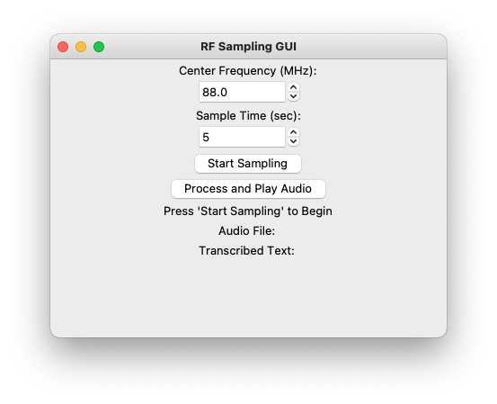

# RFDecScribe
SDR Project for CSE493W 

- [Goal of RFDecScribe](#goal-of-rfdecscribe)
- [Usage](#usage)
- [Approach](#approach)
  - [Supplies](#supplies)
  - [Decoding the RF Microphone](#decoding-the-rf-microphone)
  - [Transcribing the Audio](#transcribing-the-audio)
  - [GUI](#gui)
- [Results & Evaluation](#results--evaluation)
- [Tips](#tips)
- [Future Work](#future-work)

## Video Demo
[Video Demo](https://youtu.be/iFGZvq8biZY)

## Goal of RFDecScribe
The goal of this project is to decode an RF microphone and to transcribe the audio output. Possible uses and applications are synchronous or asynchronous transcription of radio stations and/or class lectures where audio can be transcribed. For the scope of this project, the goals were:
- Decode RF microphone signal
- Transcribe the audio
- Make a GUI interface for the program

## Usage
Make sure all libraries and depdencies are installed. Make sure that the SDR is plugged into your device.

If you wish to run the CLI version in the project path run:
`python3 decodefmCLI.py`

If you wish to run just the GUI version in the project path run:
`python3 decodefmGUI.py`

## Approach

### Supplies
#### Hardware
- Computer (Dongle with USB-A if the computer does not have a USB port)
- Software Defined Radio
- RF Microphone/Transmitter
#### Software
- Scipy
- Whisper
- Tkinter
- Threading
### Decoding the RF Microphone
The primary objective of this project phase was to decode RF microphone signals and to play the audio back. This involved implementing code inspired by this [Jupyter notebook](https://canvas.uw.edu/courses/1653575/files/104249842?wrap=1) that provided sample code for decoding RF microphone signals. The code was restructured and rewritten to operate through a command-line interface. The program sampled and processed the signals synchronously; efforts were made to achieve asynchronous sampling. However, asynchronous sampling and playback proved challenging and incompatible with the intended transcription model. The command line interface allows clients to customize parameters like the center frequency and sample duration. Noteworthy improvements were made to signal filtering techniques, specifically using IIR Notch filtering to enhance audio quality.

### Transcribing the Audio
After successfully decoding the audio from the RF microphone, the next step was to transcribe the audio. I looked online for pre-trained models and came across OpenAI’s open-source speech recognition model, [Whisper](https://github.com/openai/whisper). This turned out to be fairly easy to integrate into the CLI program I wrote. I did have to make slight modifications in the program so that the sampled audio would be saved to a .wav file so I could pass it into the model to be processed. The Whisper model has a plethora of functionality supporting different languages for transcription which I found to be fairly impressive and was a nice bonus for the project.

### GUI
Much of the time spent was rewriting and refactoring the decoding code for the decoding of the RF microphone as well as figuring out what components were needed to process the signal. With the additional time I had, I decided to make a GUI interface. I reorganized and wrote the CLI program to be compatible with a GUI. I added input areas and text areas where users could specify the center frequency, and sample time, as well as view the transcription, audio file, and program status.

## Results & Evaluation

The results of the project yielded successful results. The project achieved its goals of decoding and transcribing RF microphone signals, as well as implementing a GUI interface for the program. Overall, the program proved to be fairly reliable, achieving its goals. However, there are a number of possible improvements that could be made to enhance the efficiency and effectiveness of the program, listed below:
The program could be improved to be asynchronous (live), however, this would also introduce difficulties with how the OpenAI Whisper transcription model could work with it asynchronously.
Processing of audio takes a significant amount of time (the downsampling portion of the code)
Occasionally random freezing in the GUI and beautifying GUI
Explore functionalities in the OpenAI Whisper model
This fairly successful implementation opens up possibilities for accessibility, lecture recordings, or quite possibly a prank in conjunction with an [RF vocoder](https://github.com/keatonuw/pypv) that could capture and playback modified audio signals which can be viewed.

## Tips
During the course of this project, several tips may prove helpful:

- Explore demodulation techniques suitable for extracting the audio information from the RF signal.
- Utilize existing speech recognition APIs or libraries for efficient and accurate transcription.
- If the GUI is freezing, remember to multithread!
- Familiarize yourself with the technical specifications of the analog FM wireless microphone and the frequency range it operates in.

## Future Work
There are several avenues for future work and enhancements that can be explored:

**Improved Synchronization:** Although synchronous sampling was not implemented in this iteration, further research and experimentation could be conducted to overcome the challenges encountered. 

**Enhanced Filtering Techniques:** While the integration of IIR Notch filtering improved audio quality, exploring additional signal filtering techniques could further optimize the system's performance. Investigating advanced filtering algorithms or adaptive filtering methods may help to mitigate background noise and unwanted artifacts, resulting in even clearer and more pristine audio.

**Speech Recognition Enhancements:** The current implementation utilized existing speech recognition algorithms for real-time transcription. Future work could involve exploring other recognition models and techniques to enhance transcription accuracy.

**User Interface Refinements:** The command-line interface provided flexibility for parameter customization, but developing a more user-friendly graphical user interface (GUI) could enhance the system's usability. 

**Integration with Online/Classroom Platforms:** Consider integrating the system with popular online platforms or conferencing tools. This would allow for direct streaming of the transcribed audio, making it easier to participate in remote meetings, webinars, or online classes with real-time captions or transcriptions (though this I think has already been achieved but would be cool to replicate).

**Compatibility with Multiple RF Microphones:** Testing to see whether the system is compatible with a number of different RF microphones.
Optimization for Real-Time Performance: Optimize the code to make signal processing, decoding, and transcription more efficient.

**Integrate with Smart Devices:** Catch keywords and send commands to activate/use with smart 

